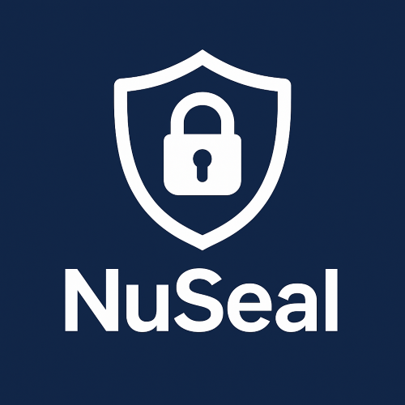

&nbsp; [](https://www.nuget.org/packages/NuSeal)

&nbsp; [](https://github.com/fiseni/NuSeal/actions/workflows/build.yml)

&nbsp; 

---
# NuSeal

NuSeal provides infrastructure for creating and validating NuGet package licenses. The validation occurs during build time, preventing unauthorized usage of your packages. It's designed to be generic while allowing each product package to set its own public key and license policies.

## Overview

NuSeal consists of two main packages:

1. **NuSeal** - Core package that validates licenses during build time (`netstandar2.0` library)
2. **NuSeal.Generator** - Helper package for generating RSA key pairs and licenses (`net8.0` library)

## Usage Guide

### TL;DR

- Authors create RSA key pairs. They may create them using `NuSeal.Generator`.
- Authors create licenses for their users using `NuSeal.Generator`. License files are named `YourProductName.license`.
- Authors embed the public key in their NuGet package using `NuSeal`. The public key file is named `YourProductName.nuseal.pem`.
- End users obtain a license file and place it in their project directory.

### For Package Authors

#### 1. Create RSA Key Pairs

Package authors first need to create public/private key pairs. You can use the `NuSeal.Generator` package for this:

```xml
<ItemGroup>
  <PackageReference Include="NuSeal.Generator" Version="0.0.1" />
</ItemGroup>
```

Then generate the keys:

```csharp
var keys = NuSeal.RsaKeyGenerator.GeneratePem();
File.WriteAllText("private_key.pem", keys.PrivateKey);
File.WriteAllText("public_key.pem", keys.PublicKey);
```

Keep the private key secure and confidential, as it will be used to sign licenses.

#### 2. Create Licenses for Users

Once you have the key pair, you can create licenses for your product:

```csharp
var license = NuSealLicense.Create(
    privateKeyPem: keys.PrivateKey,
    subscriptionId: "00000000-0000-0000-0000-000000000000",
    productName: "YourProductName",
    edition: "Free",
    issuer: "YourCompany",
    startDate: DateTimeOffset.UtcNow,
    expirationDate: DateTimeOffset.UtcNow.AddYears(1));

// Save the license to a file
File.WriteAllText("YourProductName.license", license);
```

Parameters explained:
- **privateKeyPem**: Your private RSA key in PEM format
- **subscriptionId**: Unique identifier for the customer subscription
- **productName**: Unique identifier of your product associated with this license. It might be the package name if this license is intended only for this package; or it might be a bundle name if the license is associated with group of packages. <strong>Important: this name is used for both the public key filename and license filename. It must be alphanumeric and should not contain dots (`.`).</strong>
- **edition**: Edition of your product (e.g., "Free", "Professional", "Enterprise")
- **issuer**: Your company or organization name
- **startDate**: When the license becomes valid
- **expirationDate**: When the license expires

#### 3. Protect Your NuGet Package

To protect your NuGet package, add the `NuSeal` package as a dependency:

```xml
<ItemGroup>
  <PackageReference Include="NuSeal" Version="0.1.0" />
</ItemGroup>
```

Then, add your public key as an embedded resource. The file should be named `YourProductName.nuseal.pem`:

```xml
<ItemGroup>
  <EmbeddedResource Include="YourProductName.nuseal.pem" />
</ItemGroup>
```

The package authors may include more than one pem file. It's a common practice that authors provide licenses for a single package or a bundle of packages. In this case, the author may include multiple pem files.

```xml
<ItemGroup>
  <EmbeddedResource Include="YourProductName.nuseal.pem" />
  <EmbeddedResource Include="YourBundleName.nuseal.pem" />
</ItemGroup>
```

NuSeal will try to find and validate the license against all embedded public keys. At least one valid license is required to pass the validation.

### For End Users

End users of your protected NuGet package need to:

1. Obtain a license file from you (the package author)
2. Place the license file in one of these locations:
   - Same directory as the application executable
   - Root of the solution or repository

The license file should be named `YourProductName.license` where `YourProductName` matches the `productName` parameter used when creating the license.

## How It Works

1. NuSeal runs during the build process
2. For each protected assembly, it extracts the embedded public key
3. It searches for a matching license file in the project directory tree
4. The license is validated against the public key
5. If no valid license is found, the build fails with an error

## Give a Star! :star:
If you like or are using this project please give it a star. Thanks!
